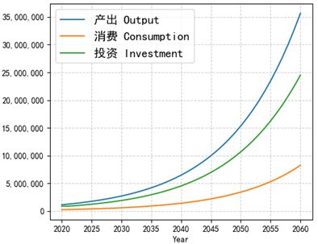
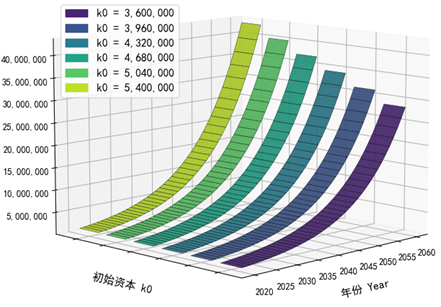
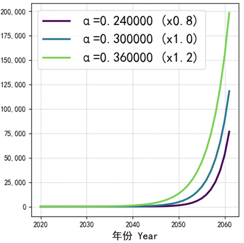
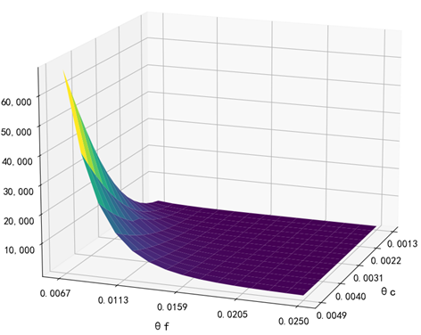

# Python Simulation of the RCK Economic Model

A comprehensive simulation and visualization of the Ramsey-Cass-Koopmans (RCK) model with carbon neutrality constrain, a fundamental model in modern macroeconomics.


---

### 🌟 Final Result: Phase Diagram

*This phase diagram shows the economy's best way to invest capital, consume and invest in carbon neutrality.*






<!-- 这里暂时留空，我们上传后再来添加图片 -->

---

### 🎯 Project Objective

- To implement the core differential equations of the RCK model in Python.
- To visualize the dynamic paths of key economic variables (capital and consumption).
- To create a clean, well-documented, and reusable script for economic modeling.

---

### 🛠️ Technologies Used

- **Language:** `Python 3`
- **Libraries:**
    - `NumPy` for efficient numerical computation.
    - `Matplotlib` for generating plots and visualizations.
    - `SciPy` for solving the system of ordinary differential equations (ODEs).

---

### 🚀 How to Run This Project

1.  **Clone the repository and navigate into the directory.**
    ```bash
    git clone https://github.com/你的用户名/rck-economic-model-simulation.git
    cd rck-economic-model-simulation
    ```
2.  **Install the necessary libraries.**
    ```bash
    pip install -r requirements.txt
    ```
3.  **Run the main simulation script.**
    ```bash
    python main_simulation.py
    ```
4.  The output plots will be saved in the `results` folder.

---